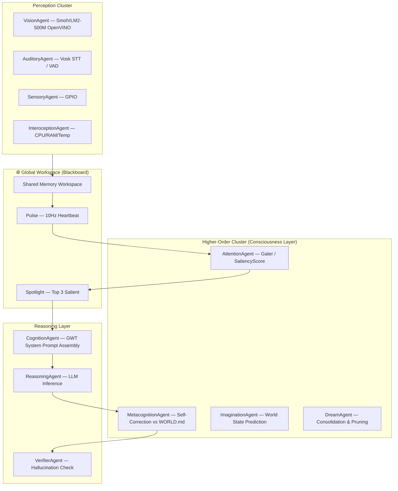

# Project-ABC: The Robotic Brain — Product Requirements Document

**Version:** 5.1  
**Date:** 2026-04-22  
**Status:** Active Development  
**Target Platform:** Intel i5-H / 16GB RAM / Intel Iris Xe (WSL2 + OpenVINO)  
**Cognitive Model:** Global Workspace Theory + Predictive Processing + Neuroplasticity

---

## 1. Vision & Executive Summary

Project-ABC is a synthetic nervous system. Version 5.0 moves beyond reactive agents into **Global Workspace Theory (GWT)**. The brain now functions via a "spotlight of attention" where competing sensory inputs must prove their **Saliency** (importance) or **Surprise** (prediction error) to reach the conscious processing layer (LLM).

Unlike traditional reactive robotic systems, Project-ABC is **proactive, emotionally aware, and persistently learning** — forming a continuous "soul" that grows with every interaction.

### Core Tenets

| Tenet | Description |
|---|---|
| **Global Workspace** | Sensory inputs compete for the spotlight; only top-3 salient signals reach the LLM |
| **Predictive Processing** | ImaginationAgent predicts next world state; surprise triggers immediate re-evaluation |
| **Embodied Cognition** | The brain is physically grounded — it feels, sees, hears, and acts |
| **Persistent Soul** | Identity, memory, and personality survive reboots and sessions |
| **Homeostatic Drives** | Curiosity, Social, and Energy drives shape autonomous behaviour |
| **Human-Like Behaviour** | Emotion-driven speech, gaze tracking, back-channel acks, volume mirroring |
| **Higher-Order Cognition** | GWT-gated ideation, imagination, metacognition, theory-of-mind — not just reactive but truly thinking |
| **Neuroplasticity** | Brain learns from user corrections, evolves communication style nightly via DreamAgent |
| **Internal Monologue** | Two-stage LLM: private "thinking" pass before every spoken response |
| **Affective Bias** | Current emotion colors salience scoring and response style in real-time |
| **Scenario Awareness** | Time-contextual preferences ("morning → coffee") stored and injected as Predicted Needs |

---

## 2. System Architecture: The Global Workspace

### 2.1 The Global Workspace (The Blackboard)

Replace the "Master Bus Router" with a **Blackboard Architecture**.

Instead of point-to-point messaging, all agents write to a high-frequency **Shared Memory Workspace**.

| Component | Description |
|---|---|
| **The Pulse (10Hz)** | A master heartbeat thread that clears stale data and triggers the AttentionAgent |
| **The Spotlight** | Only the top 3 most salient messages in the Workspace are "broadcast" to the ReasoningAgent |
| **SaliencyScore** | AttentionAgent calculates a 0.0–1.0 score for every input; messages below 0.4 are ignored |



### 2.2 The Prediction Loop (Predictive Processing)

To minimise compute and maximise "realism," the brain operates on Predictive Processing:

| Step | Agent | Action |
|---|---|---|
| **Generation** | ImaginationAgent | Predicts the next world state (e.g., "Naveen will continue typing") |
| **Comparison** | VisionAgent | Compares real frames to the prediction |
| **Surprise Trigger** | VisionAgent | If delta > 30%, fires `WORLD_SURPRISE` — bypasses standard 2.5s vision interval and forces immediate cognitive re-evaluation |

### 2.3 Message Flow (Critical Path)

```
User speaks
    → AuditoryAgent (VAD + Vosk STT + voice tone + RMS)
    → Blackboard: PERCEPTION_SPEECH
    → AttentionAgent (SaliencyScore; emotion-biased ×1.3 if SURPRISED/FRUSTRATED; discard if < 0.4)
    → Spotlight (top-3 signals broadcast)
    → CognitionAgent (GWT prompt assembly: INTERO + ATTENTION + WORLD + MEMORIES + SOUL
                      + correction detection + scenario preference capture + Predicted Needs)
    → [if correction detected] → EpisodicMemory(importance=0.9, tags=["correction"])
    → ReasoningAgent (emotion check → brevity suffix if FRUSTRATED)
        → Pass 1: COGNITION_THOUGHT (private think, 80 tokens) → VerifierAgent + WorldModel
        → Pass 2: LLM inference with thought context prepended
    → COGNITION_RESPONSE
    → MetacognitionAgent (self-correction vs WORLD.md; emits CURIOSITY_TRIGGER on new knowledge gap)
    → VerifierAgent (hallucination + world-contradiction hedge + thought-response consistency)
    → ACTION_SPEAK
    → SpeechAgent (Kokoro TTS, emotion-speed, volume-mirror)
    → AudioDriver

Prediction loop (parallel):
    → ImaginationAgent (predict next world state)
    → VisionAgent (compare real frame to prediction)
    → if delta > 30%: WORLD_SURPRISE → CognitionAgent + AttentionAgent + CuriosityAgent

Nightly dream cycle:
    → DreamAgent._consolidate_corrections() → SoulManager.update_communication_style()
    → DreamAgent._promote_recurring_to_semantic()
    → EpisodicMemory.prune_low_emotion() (pre-gated at write time by emotion pre-gate)
```

---

## 3. Agent Responsibilities

### 3.1 Higher-Order Cluster (The "Consciousness" Layer)

| Agent | V5.1 Logic |
|---|---|
| **AttentionAgent** | Acts as the "Gater." Calculates a `SaliencyScore` (0–1) for every input. If Saliency < 0.4, the message is ignored. **New:** `_current_emotion` slot — PERCEPTION salience ×1.3 when SURPRISED/FRUSTRATED. EMOTION_CHANGE now routed here. |
| **InteroceptionAgent** | Maps CPU/Temp/RAM to "Affective States." High RAM pressure → "Cognitive Fatigue" → shorter LLM responses. **New:** Auto-ECO — publishes `BEHAVIOR_CHANGE(eco=True/False)` automatically when hardware enters/leaves overwhelmed state. |
| **MetacognitionAgent** | Performs "Self-Correction." After LLM generates a response, checks it against `WORLD.md` facts. **New:** Emits `CURIOSITY_TRIGGER(source="knowledge_gap", topic=...)` on new knowledge gaps so CuriosityAgent asks a targeted follow-up. |
| **DreamAgent** | Consolidation & Pruning. Deletes episodic memories with low emotional weight. Converts recurring episodes into Semantic Facts. **New:** `_consolidate_corrections()` — queries correction-tagged episodes, extracts style insights, updates `SoulManager.communication_style_history`. |
| **ImaginationAgent** | World-state prediction engine. Generates next-state hypotheses; supplies prediction delta to VisionAgent for surprise detection. |
| **CuriosityAgent** | **New:** Handles `WORLD_SURPRISE` — generates immediate "What just changed?" question via LLM. Handles `CURIOSITY_TRIGGER(source="knowledge_gap")` — generates targeted clarifying question instead of generic exploration. |
| **ReasoningAgent** | **New:** Two-stage LLM pass — Pass 1 (private think, 80 tokens, skipped when max_tokens≤60) → publishes `COGNITION_THOUGHT` → Pass 2 (respond with thought prepended). Emotion-aware: appends brevity suffix when FRUSTRATED. |
| **VerifierAgent** | **New:** Stores `_last_thought`; enforces brevity cap (>200 chars) and empathy prefix from thought intent. World-contradiction hedge ("I can only confirm what I know for certain"). |
| **CognitionAgent** | **New:** Correction detection (`_CORRECTION_PHRASES`); scenario preference capture (`_SCENARIO_PATTERNS`); `## Predicted Needs` section from time-contextual habits; emotion forwarded in `COGNITION_INTENT` to ReasoningAgent. |

### 3.2 Full Agent Roster (25 Agents)

| Agent | Brain Region | Key Responsibility |
|---|---|---|
| VisionAgent | Visual Cortex | SmolVLM2-500M (OpenVINO), 6-frame RingBuffer, continuous activity stream, surprise heuristic |
| AuditoryAgent | Auditory Cortex | Vosk STT, VAD, voice tone/RMS, back-channel acks |
| SensoryAgent | Somatosensory | GPIO sensors, touch/proximity |
| LanguageAgent | Wernicke's/Broca's | Intent classification (16 intents), entity extraction, sentiment |
| CognitionAgent | Hippocampus + PFC | **GWT prompt assembly** (INTERO → ATTENTION → WORLD → MEMORIES → SOUL order) |
| ReasoningAgent | Lateral PFC | LLM inference, autonomous retry/fallback, follow-up questions (1-in-4) |
| LogicAgent | Basal Ganglia | Safety rules, command validation |
| VerifierAgent | Anterior Cingulate | Hallucination detection, repetition check, retry on failure |
| EmotionEngine | Limbic System | 10-state FSM with timed auto-transitions, voice tone empathy |
| BehaviorAgent | Cingulate Cortex | 5-state FSM (IDLE/ATTENTIVE/FOCUSED/EXPLORING/ECO), fatigue detection |
| MotorAgent | Motor Cortex | Pan-tilt servo, wheel commands, gaze-driven look_at |
| DisplayAgent | Visual Cortex Output | Emotion GIF compositor, HUD overlay, SPI display |
| SpeechAgent | Broca's Area Output | Kokoro TTS queue, emotion-speed mapping, interrupt ack, **volume mirroring** |
| CuriosityAgent | Default Mode Network | Proactive check-ins, tone-aware phrases, habit-aware 3-min silence trigger |
| DreamAgent | Sleep Consolidation | Memory pruning (low emotional weight), semantic upsert, personality evolution, habit detection |
| PlannerAgent | Prefrontal Planning | Delayed task execution, cancel-safe queue snapshot iteration |
| AttentionAgent | Posterior Parietal + Dorsal ACC | **GWT Gater** — SaliencyScore, spotlight top-3, discard < 0.4 |
| InteroceptionAgent | Insula | CPU/RAM/temp → Affective States → EmotionEngine + response length modulation |
| MetacognitionAgent | Anterior PFC | Self-correction vs WORLD.md; confidence scoring; uncertainty prefix |
| TheoryOfMindAgent | Medial PFC + Temporal Poles | User confusion/expertise detection; USER_MODEL_UPDATE |
| TemporalReasoningAgent | Basal Ganglia + Cerebellum | Hour-of-day patterns, causal language, TEMPORAL_INSIGHT |
| IntrinsicMotivationAgent | OFC + Ventral Striatum | Drive hierarchy (Curiosity/Social/Energy), knowledge-gap seeking |
| IdeationAgent | DLPFC + Angular Gyrus + DMN | Cross-domain synthesis, semantic neighbour retrieval, 60s cooldown |
| ImaginationAgent | Hippocampus + PFC (forward) | **Predictive world-state generation**; what-if modeling; prediction delta for WORLD_SURPRISE |
| TheoryOfMindAgent | Medial PFC | User model updates |

### 3.3 VisionAgent (The Video Processor)

| Property | Value |
|---|---|
| Model | SmolVLM2-500M (OpenVINO optimised) |
| Input | 6-frame RingBuffer (3-second window) |
| Output | Continuous activity stream (not static descriptions) |
| Surprise Heuristic | Compares frame to ImaginationAgent prediction; fires `WORLD_SURPRISE` if delta > 30% |
| Standard Interval | 2.5 seconds |
| Surprise Interval | Immediate (bypasses standard interval) |

---

## 4. Memory System (Temporal Scaling)

| Layer | Type | Hardware | Brain Equivalent | Persistence |
|---|---|---|---|---|
| **Sensory** | Redis / In-Memory RingBuffer | RAM | Thalamus | 3 seconds |
| **Working** | Context Window | RAM | Prefrontal Cortex | 10 minutes |
| **Episodic** | SQLite FTS5 | Disk (SSD) | Hippocampus | 7 days (then pruned) |
| **Semantic** | sqlite-vec Vector DB | Disk (SSD) | Neocortex | Permanent |
| **Soul** | Markdown Static File | Disk (SSD) | DNA / Personality | Permanent |

Key algorithms:
- **Salience ranking**: `importance + EMOTION_SALIENCE[emotion]` — emotionally charged memories surface first
- **Memory decay**: `importance *= 0.85` weekly on unreinforced memories < 0.8 importance; DreamAgent prunes entries with low emotional weight
- **Context compaction**: auto-summarise at 12 turns; last session restored on boot
- **Habit detection**: group user episodes by hour-of-day across 7 days; flag 3+ day recurrences; convert to Semantic Facts in USER.json

---

## 5. Soul & Identity System

### 5.1 Persistent Files

| File | Purpose |
|---|---|
| `data/SOUL.md` | Core personality, values, history, daily insights, **Homeostatic Drives** |
| `data/USER.json` | Structured user profile — OCEAN traits, habits, insights, trust level |
| `data/USER.md` | Free-text user notes |
| `data/WORLD.md` | Environment model (MetacognitionAgent validates responses against this) |
| `data/SKILLS.json` | Learned conditional skills ("whenever X, do Y") |
| `data/DREAM_LOG.md` | Nightly dream journal entries |

### 5.2 The "Homeostatic Drive" (New SOUL.md Section)

Add a **Drives** section to `SOUL.md`:

| Drive | Trigger | Behaviour |
|---|---|---|
| **Curiosity Drive** | No new information in the Workspace for 5 minutes | Increases → proactive exploration, novel question generation |
| **Social Drive** | `PERSON_PRESENT = true` AND `CONVERSATION_ACTIVE = false` | Increases → initiate conversation opener |
| **Energy Drive** | Decreases with uptime | When low → triggers ECO Mode (llama3.2:1b only, 30s camera interval) |

### 5.3 USER.json Schema

```json
{
  "identity": {"name": "Naveen", "confidence": 0.9},
  "preferences": [],
  "topics_of_interest": [],
  "communication_style": "direct and technical",
  "context": {"location": "...", "occupation": "..."},
  "relationship": {"total_interactions": 247, "trust_level": "familiar"},
  "personality_traits": {
    "openness": 0.72, "conscientiousness": 0.61,
    "extraversion": 0.51, "agreeableness": 0.81, "neuroticism": 0.29
  },
  "habits": [
    {"hour": 9, "time_label": "9:00 AM", "days_observed": 5}
  ],
  "llm_insights": [],
  "scenario_preferences": {
    "morning": "coffee",
    "evening": "tea"
  },
  "communication_style_history": [
    {"insight": "User prefers shorter answers — avoid over-explaining.", "added_at": "..."}
  ]
}
```

**New in v5.1:**
- `scenario_preferences` — time-contextual preferences detected from speech ("In the morning I like coffee") and injected as `## Predicted Needs` in the system prompt
- `communication_style_history` — FIFO list (max 10) of style insights learned from user corrections via DreamAgent nightly consolidation

### 5.4 Trust Progression

| Interactions | Trust Level |
|---|---|
| 0–9 | new |
| 10–29 | developing |
| 30–99 | familiar |
| 100+ | close |

---

## 6. GWT System Prompt Assembly

CognitionAgent assembles the system prompt in this **exact priority order**:

| Priority | Section | Example |
|---|---|---|
| 1 | **INTERO_STATE** | "You feel overwhelmed and hot." |
| 2 | **ATTENTION_FOCUS** | "You are currently focused on Naveen's question about Golang." |
| 3 | **WORLD_SNAPSHOT** | "Naveen is looking at you and appears frustrated." |
| 4 | **RELEVANT_MEMORIES** | "Naveen mentioned a peanut allergy 3 days ago." |
| 5 | **PERSONALITY** | SOUL.md content + OCEAN personality line |
| 6 | User profile, time-of-day, current emotion/behavior |
| 7 | Skills, mood arc, user model, temporal insights |
| 8 | **PREDICTED NEEDS** *(v5.1)* | "It is morning. user may want coffee \| usual habit: reading." |
| 0 (pre-pass) | **INTERNAL THOUGHT** *(v5.1)* | ReasoningAgent Pass 1: "User wants a brief factual answer. Use calm direct tone." → prepended to Pass 2 system prompt |

**v5.1 additions to CognitionAgent `_process_intent()`:**
- Correction detection: if user text matches `_CORRECTION_PHRASES`, log `Episode(importance=0.9, tags=["correction"])` for DreamAgent consolidation
- Scenario preference capture: regex detects "In the morning I like X" → `SoulManager.upsert_scenario_preference()`
- `## Predicted Needs` section: injects current `time_label` scenario preference + matching habit from USER.json
- `emotion` field forwarded in `COGNITION_INTENT` data to ReasoningAgent for affective bias

---

## 7. LLM Routing

| Tier | Model | Use Case |
|---|---|---|
| **Reflexive** | Ollama `llama3.2:1b` (Local) | Intent classification, small talk, reflex responses |
| **Cognitive** | Gemini 2.0 Flash (Cloud) | Reasoning, deep conversation, complex queries |
| ECO Mode | `llama3.2:1b` only | Energy Drive low; ignores all routing tiers |

Semantic response cache: cosine similarity ≥ 0.97 → return cached, skip LLM (5min TTL).

---

## 8. Hardware & Performance Specs

### 8.1 Target Platform

| Component | Spec |
|---|---|
| CPU | Intel i5-H (4+ cores) |
| RAM | 16GB |
| GPU | Intel Iris Xe (OpenVINO acceleration) |
| Runtime | WSL2 + OpenVINO Toolkit |

### 8.2 Inference Latency Targets

| Component | Target |
|---|---|
| Vision Understanding (SmolVLM2-500M OpenVINO) | < 1.2s |
| TTS (Kokoro ONNX) | < 500ms |
| Thought (LLM reflexive) | < 2.0s |
| Attention Gating (10Hz pulse) | < 10ms per cycle |

### 8.3 Primary Engine

- **OpenVINO Toolkit** for all local model inference (SmolVLM2-500M, Kokoro ONNX, Vosk)
- All hardware accessed through typed drivers — agents never touch hardware directly

---

## 9. Message Types

### 9.1 Core Message Bus

```python
PERCEPTION_SPEECH    # STT result + voice tone + RMS → Blackboard
PERCEPTION_VISION    # SmolVLM2 activity stream + face data → Blackboard
PERCEPTION_SENSOR    # GPIO sensor events → Blackboard
WORLD_SURPRISE       # VisionAgent: prediction delta > 30% → immediate re-eval
COGNITION_INTENT     # Parsed intent + entities (Language → Cognition)
COGNITION_RESPONSE   # LLM response (Reasoning → MetaCog → Verifier)
ACTION_SPEAK         # TTS request (VerifierAgent → SpeechAgent)
ACTION_DISPLAY       # Display update request
ACTION_MOVE          # Motor command
EMOTION_CHANGE       # State transition
BEHAVIOR_CHANGE      # FSM transition + eco flag
CURIOSITY_TRIGGER    # Idle → exploration
MEMORY_WRITE         # Context management
SELF_REFLECT         # Periodic introspection trigger
SKILL_LEARN          # New conditional skill taught
DREAM_START/DONE     # Dream cycle lifecycle
PRIVACY_MODE         # Camera+mic toggle
PLAN_STEP/CANCEL     # Planner lifecycle
```

### 9.2 GWT/Higher-Order Message Types

| MessageType | Publisher | Consumers |
|---|---|---|
| `ATTENTION_FOCUS` | AttentionAgent | CognitionAgent, BehaviorAgent |
| `ATTENTION_SHIFT` | AttentionAgent | CognitionAgent, BehaviorAgent, EmotionEngine |
| `WORLD_SURPRISE` | VisionAgent / VisionProcessor | CognitionAgent, AttentionAgent, **CuriosityAgent** *(v5.1)* |
| `INTERO_STATE` | InteroceptionAgent | EmotionEngine, BehaviorAgent, IntrinsicMotivationAgent, CognitionAgent |
| `BEHAVIOR_CHANGE(eco)` | **InteroceptionAgent** *(v5.1 auto-ECO)* | EmotionEngine, CognitionAgent (→ LLMRouter.set_eco_mode) |
| `METACOG_CONFIDENCE` | MetacognitionAgent | VerifierAgent |
| `CURIOSITY_TRIGGER(knowledge_gap)` | **MetacognitionAgent** *(v5.1)* | CuriosityAgent (targeted question) |
| `COGNITION_THOUGHT` | **ReasoningAgent** *(v5.1)* | VerifierAgent (consistency), WorldModel (via Orchestrator) |
| `EMOTION_CHANGE` | EmotionEngine | DisplayAgent, MotorAgent, CognitionAgent, SpeechAgent, **AttentionAgent** *(v5.1)* |
| `USER_MODEL_UPDATE` | TheoryOfMindAgent | CognitionAgent |
| `TEMPORAL_INSIGHT` | TemporalReasoningAgent | CognitionAgent |
| `MOTIVATION_DRIVE` | IntrinsicMotivationAgent | BehaviorAgent, CuriosityAgent |
| `IDEATION_RESULT` | IdeationAgent | CognitionAgent |
| `IMAGINATION_SIMULATE` | ImaginationAgent | CognitionAgent, PlannerAgent, VisionAgent (prediction target) |

---

## 10. Data Flow & Routing

### 10.1 Blackboard Routing (replaces direct pub/sub)

The Orchestrator now uses `asyncio.Queue`-based Blackboard rather than point-to-point pub/sub:

- All agents **write** to the Blackboard with a `SaliencyScore` field
- The **Pulse (10Hz)** clears entries older than their TTL and triggers AttentionAgent
- AttentionAgent **gates** entries: score < 0.4 → discarded; top-3 → Spotlight
- Spotlight entries are **broadcast** to CognitionAgent as the conscious working set

### 10.2 Key Routing Decisions

- `PERCEPTION_SPEECH` → Blackboard → AttentionAgent gating → CognitionAgent (if salient)
- `WORLD_SURPRISE` → bypasses AttentionAgent gating → direct CognitionAgent re-evaluation
- `COGNITION_RESPONSE` → MetacognitionAgent (WORLD.md check) → VerifierAgent → ACTION_SPEAK
- `INTERO_STATE` → EmotionEngine + CognitionAgent (prompt slot 1, highest priority)

---

## 11. API Specification

### 11.1 REST Endpoints (port 8080)

| Method | Path | Description |
|---|---|---|
| GET | `/status` | Brain health, emotion, behavior, uptime, drive levels |
| GET | `/memory/recent` | Last N episodic events |
| GET | `/memory/search?q=` | FTS5 full-text search |
| POST | `/speak` | Inject text as ACTION_SPEAK |
| POST | `/chat` | Send user message to brain |
| POST | `/move` | Motor command |
| POST | `/dream` | Trigger dream cycle manually |
| GET | `/soul` | Current SOUL.md content |
| GET | `/user` | USER.json profile |
| POST | `/privacy` | Toggle privacy mode |
| GET | `/workspace` | Current Blackboard state (Spotlight top-3) |
| GET | `/drives` | Current homeostatic drive levels |

### 11.2 WebSocket

- `ws://brain.local:8080/ws` — real-time event stream (all bus messages as JSON)
- Safe JSON serialisation handles numpy arrays, NaN/Inf floats, bytes
- 5s heartbeat keepalive

---

## 12. Autonomous Behaviours

| Behaviour | Trigger | Action |
|---|---|---|
| Curiosity exploration | Curiosity Drive high (5min no new Workspace data) | Pan-tilt scan / passive watch / internal monologue |
| Proactive check-in | Social Drive high (`PERSON_PRESENT=true`, 3min silence) | Tone-aware or habit-aware conversational opener |
| **Knowledge-gap curiosity** *(v5.1)* | MetacognitionAgent detects new knowledge gap (confidence < 0.3) | CuriosityAgent generates targeted clarifying question |
| **Surprise reaction** *(v5.1)* | `WORLD_SURPRISE` fired | CuriosityAgent generates immediate "What just changed?" question |
| **Auto-ECO** *(v5.1)* | CPU > 85% or RAM > 85% (InteroceptionAgent) | Automatic `BEHAVIOR_CHANGE(eco=True)` → LLMRouter uses simple model only |
| Self-reflection | Every 30min of active use | LLM introspection + episodic storage |
| Nightly dream cycle | 2AM systemd timer | Memory pruning, semantic upsert, personality evolution, **correction consolidation** *(v5.1)* |
| **Correction learning** *(v5.1)* | User says "that's wrong" / "not what I meant" | Episode stored (importance=0.9); DreamAgent extracts style insight nightly |
| Context compaction | 12 conversation turns | Auto-summarise old turns, keep last 4 verbatim |
| Privacy mode | GPIO button | Disable camera + mic, show privacy indicator |
| World Surprise | Prediction delta > 30% | Immediate cognitive re-evaluation + CuriosityAgent question |

---

## 13. Human-Like Features (F1–F12)

| # | Feature | Implementation |
|---|---|---|
| F1 | Emotion-aware TTS speed | EXCITED→1.15x, SAD→0.85x via Kokoro `speed` param |
| F2 | Follow-up questions | 1-in-4 responses append natural question ("Does that help?") |
| F3 | Back-channel acks | After 5s of user speaking: "Mm-hmm." / "Go on." |
| F4 | Use user's name | Injected to system prompt; used naturally every few exchanges |
| F5 | Time-of-day awareness | Morning/afternoon/evening/night context injected to system prompt |
| F6 | Personality evolution | DreamAgent asks LLM for OCEAN deltas (±0.01); stored in USER.json |
| F7 | Memory decay | Weekly Ebbinghaus-style importance decay; DreamAgent prunes low-weight entries |
| F8 | Gaze tracking | Face bbox offset → ACTION_MOVE look_at (throttled, >12% frame movement) |
| F9 | Interrupted speech ack | After barge-in: "Go ahead." / "Yes?" after 250ms |
| F10 | Confidence expression | "I think/believe/I'm not sure" instruction in system prompt |
| F11 | Volume mirroring | User RMS → linear volume 60–95; applied as numpy amplitude scaling; SpeechAgent matches your voice dB level |
| F12 | Habit detection | DreamAgent finds recurring hour-of-day patterns; converts to Semantic Facts in USER.json |

---

## 14. Configuration

Key config values (`config/config.yaml`):

```yaml
brain:
  idle_timeout_seconds: 60
  pulse_hz: 10                      # Global Workspace heartbeat
  spotlight_size: 3                 # Top-N salient messages to broadcast
  salience_threshold: 0.4           # Minimum SaliencyScore to enter Workspace
  surprise_threshold: 0.30          # Vision prediction delta for WORLD_SURPRISE

llm:
  reflexive_model: "llama3.2:1b"    # Local, fast — intent/small talk
  cognitive_model: "gemini-2.0-flash"  # Cloud — reasoning/deep talk
  eco_model: "llama3.2:1b"

vision:
  model: "smolvlm2-500m"
  backend: "openvino"
  ring_buffer_frames: 6
  ring_buffer_seconds: 3
  standard_interval_s: 2.5

memory:
  sensory_ttl_s: 3
  working_ttl_m: 10
  episodic_ttl_days: 7
  restore_on_startup: true
  restore_exchanges: 6

audio:
  output:
    tts_engine: "kokoro"
    volume_mirror: true
```

API keys loaded from `config/.env` (never committed):
- `GOOGLE_AI_API_KEY`
- `ANTHROPIC_API_KEY`
- `OPENROUTER_API_KEY`
- `ELEVENLABS_API_KEY`

---

## 15. Quality & Testing

### 15.1 Verification Checklist

- [ ] `python scripts/hw_test.py` — all detected hardware passes
- [ ] `python -m brain --mock --dry-run` — all 25 agents init, exit cleanly
- [ ] `curl http://localhost:8080/status` — API responds with correct JSON
- [ ] `curl http://localhost:8080/workspace` — Blackboard Spotlight returns top-3
- [ ] Speak "Hey Brain, how are you?" — full STT→LLM→TTS pipeline
- [ ] Check `data/episodes.db` — events logged with emotion field
- [ ] Wait 5 minutes idle — Curiosity Drive increases, CuriosityAgent fires
- [ ] Cover camera, wait for motion — VisionAgent surprise delta fires `WORLD_SURPRISE`
- [ ] Wait for 2AM — DreamAgent prunes low-weight memories, converts habits to semantic facts
- [ ] Say "Cancel" mid-reminder — PlannerAgent cancels cleanly
- [ ] Interrupt Brain mid-sentence — back-channel ack fires within 300ms
- [ ] Monitor InteroceptionAgent — CPU spike → INTERO_STATE changes → LLM response shortens

### 15.2 Known Constraints

| Constraint | Detail |
|---|---|
| OpenVINO | Requires Intel OpenVINO Toolkit installed in WSL2 |
| SmolVLM2-500M | Needs OpenVINO IR export; see `scripts/export_smolvlm2_openvino.py` |
| Kokoro TTS | Requires `kokoro-v1.0.onnx` + `voices-v1.0.bin` in `assets/models/kokoro/` |
| Vosk STT | Requires `vosk-model-small-en-us-0.15` in `assets/models/` |
| sqlite-vec | Replaces ChromaDB for semantic memory — lighter, no daemon required |
| Gemini 2.0 Flash | Cloud; requires `GOOGLE_AI_API_KEY`; subject to daily quota |

---

## 16. Architecture Decisions & Rationale

| Decision | Rationale |
|---|---|
| Blackboard over pub/sub | GWT requires all agents to compete for attention — direct pub/sub can't model salience gating |
| asyncio.Queue Blackboard | Single-threaded cooperative scheduling; Pulse tick drives attention without OS thread overhead |
| SaliencyScore gating | Prevents LLM from being flooded with low-priority inputs; mirrors thalamic gating in neuroscience |
| Spotlight top-3 | Cognitive load limit — humans consciously process ~3–4 items; keeps LLM context focused |
| Predictive processing loop | Reduces unnecessary VLM calls; only real scene changes (>30% delta) trigger inference |
| SmolVLM2-500M + OpenVINO | 500M model fits in Iris Xe iGPU; OpenVINO provides INT8 inference at < 1.2s |
| sqlite-vec over ChromaDB | No daemon, single file, WAL mode — cleaner for local deployment |
| GWT prompt priority order | INTERO before ATTENTION before WORLD mirrors biological signal priority (body state → focus → environment) |
| Volume mirroring | Matching speaker volume to user vocal level is a known rapport-building behaviour |
| DreamAgent semantic promotion | Recurring episodic patterns become permanent facts — mirrors hippocampal→neocortical consolidation |
| llama3.2:1b for reflexive | 1B model is 3x faster than 3B for sub-150 token tasks; no quality loss for intent/small talk |
| Gemini 2.0 Flash for cognitive | Best free-tier performance/quality ratio for reasoning tasks as of 2026-04 |

---

## 17. Change Log: v4.0 → v5.0

| Action | Detail |
|---|---|
| **DELETED** | All references to "Raspberry Pi" and "limited RAM" — platform is now Intel i5-H / 16GB / Iris Xe |
| **DELETED** | ChromaDB — replaced by sqlite-vec |
| **DELETED** | Moondream VLM — replaced by SmolVLM2-500M (OpenVINO) |
| **UPDATED** | Orchestrator — asyncio.Queue Blackboard replaces direct pub/sub routing |
| **UPDATED** | CognitionAgent — GWT prompt assembly order (INTERO → ATTENTION → WORLD → MEMORIES → SOUL) |
| **UPDATED** | SpeechAgent — Volume Mirroring matches your voice dB level |
| **UPDATED** | AttentionAgent — now acts as GWT Gater with SaliencyScore < 0.4 discard |
| **UPDATED** | DreamAgent — adds low-emotional-weight pruning and episodic → semantic fact conversion |
| **UPDATED** | InteroceptionAgent — maps vitals to Affective States that modulate LLM response length |
| **UPDATED** | VisionAgent — 6-frame RingBuffer, continuous activity stream, surprise heuristic |
| **UPDATED** | LLM routing — Reflexive: llama3.2:1b / Cognitive: Gemini 2.0 Flash |
| **ADDED** | The Pulse (10Hz heartbeat thread) |
| **ADDED** | Spotlight (top-3 salience broadcast) |
| **ADDED** | Predictive Processing loop (ImaginationAgent → VisionAgent → WORLD_SURPRISE) |
| **ADDED** | Homeostatic Drives section in SOUL.md (Curiosity / Social / Energy) |
| **ADDED** | InteroceptionAgent monitoring script for system vitals |
| **ADDED** | SurpriseHeuristic in VisionAgent (>30% prediction delta → WORLD_SURPRISE) |
| **ADDED** | `/workspace` and `/drives` API endpoints |

---

## 18. Change Log: v5.0 → v5.1

### Phase A — Stability & Homeostasis

| Action | File | Detail |
|---|---|---|
| **ADDED** | `interoception_agent.py` | Auto-ECO: publishes `BEHAVIOR_CHANGE(eco=True/False)` when hardware enters/leaves overwhelmed state; `_last_eco_mode` dedup prevents duplicate signals |
| **ADDED** | `episodic_memory.py` | Emotion pre-gate in `log_event()`: routine perception events with no useful emotion AND importance < 0.2 are silently skipped to keep SQLite lean |
| **ADDED** | `metacognition_agent.py` | `_track_knowledge_gap()` returns bool; emits `CURIOSITY_TRIGGER(source="knowledge_gap", topic=...)` on new gaps only |
| **ADDED** | `curiosity_agent.py` | `_on_knowledge_gap(topic)`: LLM-generated targeted question; `_on_world_surprise(data)`: proactive "What just changed?" on `WORLD_SURPRISE` |
| **UPDATED** | `orchestrator.py` | `WORLD_SURPRISE` now routes to `curiosity_agent`; `EMOTION_CHANGE` now routes to `attention_agent` |

### Phase B — Affective Bias & Learning

| Action | File | Detail |
|---|---|---|
| **ADDED** | `attention_agent.py` | `_current_emotion` slot updated by EMOTION_CHANGE; PERCEPTION salience ×1.3 when SURPRISED/FRUSTRATED |
| **ADDED** | `reasoning_agent.py` | Extracts `emotion` from COGNITION_INTENT; appends brevity suffix to system_prompt when FRUSTRATED |
| **ADDED** | `verifier_agent.py` | World-contradiction hedge ("I can only confirm what I know for certain —") from MetacognitionAgent's `world_contradiction` flag |
| **ADDED** | `cognition_agent.py` | Correction detection (`_CORRECTION_PHRASES`): stores `Episode(importance=0.9, tags=["correction"])` |
| **ADDED** | `cognition_agent.py` | Scenario preference capture (`_SCENARIO_PATTERNS`, `_capture_scenario_preferences()`) |
| **ADDED** | `cognition_agent.py` | `## Predicted Needs` section injected from `scenario_preferences` + matching habits for current time_label |
| **ADDED** | `cognition_agent.py` | `emotion` field forwarded in `COGNITION_INTENT` data to ReasoningAgent |
| **ADDED** | `soul_manager.py` | `upsert_scenario_preference()`, `get_scenario_preferences()` for N2a scenario mapping |
| **ADDED** | `soul_manager.py` | `update_communication_style()`, `get_communication_style_history()` FIFO (max 10) for N1c neuroplasticity |
| **UPDATED** | `soul_manager.py` | `get_user_summary()` surfaces latest communication style insight; `_EMPTY_USER_JSON` adds `scenario_preferences` and `communication_style_history` fields |

### Phase C — Deep Cognition & Neuroplasticity

| Action | File | Detail |
|---|---|---|
| **ADDED** | `base_agent.py` | `COGNITION_THOUGHT = "cognition.thought"` MessageType for internal monologue |
| **ADDED** | `reasoning_agent.py` | Two-stage LLM: Pass 1 (think, 80 tokens, skipped when max_tokens≤60) publishes `COGNITION_THOUGHT`; Pass 2 responds with thought prepended to system_prompt |
| **ADDED** | `verifier_agent.py` | `_last_thought` stored from `COGNITION_THOUGHT`; brevity cap (>200 chars) and empathy prefix enforced against thought intent |
| **ADDED** | `world_model.py` | `_current_thought` field; `update_thought()` / `get_thought()` async methods |
| **UPDATED** | `orchestrator.py` | `COGNITION_THOUGHT` routes to `verifier_agent`; `_route()` wires `COGNITION_THOUGHT` → `world_model.update_thought()` |
| **ADDED** | `dream_agent.py` | `_consolidate_corrections()`: queries correction-tagged episodes (7 days), LLM extracts style insight, calls `SoulManager.update_communication_style()` |

---

## 19. File Structure

```
Project-ABC/
├── brain/
│   ├── agents/          # 25 agents (perception, reasoning, execution, autonomy, higher-order)
│   ├── hardware/        # Hardware drivers (OpenVINO backend, smolvlm2_processor.py)
│   ├── identity/        # personality_core.py (tone modifiers — used by soul_manager)
│   ├── llm/             # LLM router + clients (Ollama, Gemini, OpenRouter, Claude)
│   ├── memory/          # Working, episodic, semantic (sqlite-vec), soul_manager
│   ├── workspace/       # Blackboard, Pulse, Spotlight, SaliencyScorer
│   ├── utils/           # config, logger, watchdog
│   ├── orchestrator.py  # asyncio.Queue Blackboard dispatcher
│   └── __main__.py      # Boot sequence
├── api/
│   ├── rest_api.py      # FastAPI REST endpoints (incl. /workspace, /drives)
│   └── ws_api.py        # WebSocket event stream
├── config/
│   ├── config.yaml      # Runtime configuration
│   ├── hardware.yaml    # Hardware capability overrides
│   ├── emotions.yaml    # Emotion → GIF mapping
│   └── .env.example     # API key template
├── data/                # Runtime data (DB, soul files, logs)
├── assets/
│   ├── emotions/        # Emotion GIF files
│   └── models/          # Vosk, Kokoro ONNX, SmolVLM2 OpenVINO IR
├── scripts/
│   ├── setup.sh
│   ├── hw_test.py
│   ├── export_smolvlm2_openvino.py  # Export SmolVLM2-500M to OpenVINO IR
│   └── download_emotions.py
├── services/            # systemd service + timer files
└── tests/               # Agent unit tests
```
